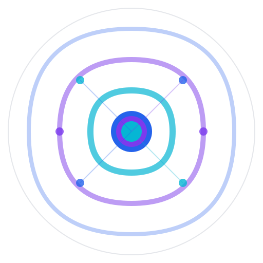

# 🎉 VortexRAG 仓库设置完成总结

## ✅ 已完成的工作

### 1. 代码和功能
- ✅ 后台任务自动创建会话功能
- ✅ Vue-UI 迁移到 ui/frontend
- ✅ UltraRAG → VortexRAG 完整重命名
- ✅ 超时处理和取消机制改进
- ✅ 清理不需要的文件

### 2. 文档
- ✅ 全新的专业 README.md
- ✅ REBRANDING_SUMMARY.md
- ✅ GITHUB_PUSH_GUIDE.md
- ✅ LOGO_AND_SETUP_GUIDE.md

### 3. 品牌资产
- ✅ VortexRAG SVG Logo (docs/vortexrag-logo.svg)
- ✅ 配色方案定义
- ✅ 品牌指南

### 4. GitHub 仓库
- ✅ 推送到 https://github.com/Peppermeow29/VortexRAG
- ✅ 285 个文件，54,847 行代码
- ✅ .claude/ 目录已排除

---

## 📋 手动设置清单

请访问 GitHub 完成以下设置：

### 1. 添加 Topics (标签)

访问：https://github.com/Peppermeow29/VortexRAG

点击 **"Add topics"**，添加：

**必须添加：**
```
rag
retrieval-augmented-generation
llm
large-language-models
ai
python
vue
flask
knowledge-base
vector-database
```

**推荐添加：**
```
machine-learning
milvus
faiss
embeddings
semantic-search
openai
ollama
vllm
huggingface
mcp
chatbot
question-answering
document-qa
```

### 2. 设置 About 描述

在仓库页面右侧，点击 **⚙️ 图标**：

**Description:**
```
🌀 Advanced RAG Framework - Empowering AI with Knowledge | Production-ready retrieval-augmented generation with Vue 3 UI, multi-model support, and MCP architecture
```

**Website:**
```
https://github.com/Peppermeow29/VortexRAG
```

### 3. 启用功能

访问：https://github.com/Peppermeow29/VortexRAG/settings

在 **Features** 部分勾选：
- ✅ Issues
- ✅ Discussions
- ✅ Projects (可选)
- ✅ Wiki (可选)

### 4. 上传 Social Preview (可选)

在 Settings 页面，滚动到 **"Social preview"**：
1. 点击 **"Edit"**
2. 上传横幅图片 (1280x640)
3. 可以使用 docs/vortexrag-logo.svg 作为基础制作

---

## 🎨 Logo 使用

Logo 文件位置：
```
docs/vortexrag-logo.svg
```

**在 README 中使用：**
```markdown

```

**配色方案：**
- 主色：`#2563EB` (深蓝)
- 辅色：`#7C3AED` (紫色)
- 强调色：`#06B6D4` (青色)

---

## 📊 仓库统计

- **文件数：** 285
- **代码行数：** 54,847
- **提交数：** 20+
- **分支：** main
- **许可证：** Apache 2.0

---

## 🔗 重要链接

- **仓库主页：** https://github.com/Peppermeow29/VortexRAG
- **Issues：** https://github.com/Peppermeow29/VortexRAG/issues
- **Discussions：** https://github.com/Peppermeow29/VortexRAG/discussions
- **原始 UltraRAG：** https://github.com/OpenBMB/UltraRAG

---

## 🚀 推广建议

### 1. 社交媒体
分享你的项目：
```
🌀 刚刚发布了 VortexRAG - 一个生产级的 RAG 框架！

✨ 特性：
- Vue 3 现代化 UI
- 多模型支持 (OpenAI, Ollama, vLLM)
- 完整的知识库管理
- 后台任务处理

🔗 https://github.com/Peppermeow29/VortexRAG

#RAG #AI #LLM #OpenSource
```

### 2. 技术社区
发布到：
- Reddit (r/MachineLearning, r/LocalLLaMA)
- Hacker News
- Product Hunt
- Dev.to
- 掘金/CSDN (中文社区)

### 3. 创建 Demo 视频
录制一个 5 分钟的演示视频展示：
- 安装过程
- UI 界面
- 上传文档
- 提问和回答
- 后台任务

---

## 📈 下一步发展

### 短期 (1-2 周)
- [ ] 添加更多示例 pipeline
- [ ] 完善文档
- [ ] 修复已知 bug
- [ ] 添加单元测试

### 中期 (1-2 月)
- [ ] 支持更多向量数据库
- [ ] 添加更多 LLM 后端
- [ ] 性能优化
- [ ] Docker 部署支持

### 长期 (3-6 月)
- [ ] 插件系统
- [ ] 云部署方案
- [ ] 企业版功能
- [ ] 多语言支持

---

## 🙏 致谢

感谢以下项目和社区：
- **UltraRAG** - 原始框架
- **OpenBMB** - 开源社区
- **Vue.js** - 前端框架
- **Flask** - 后端框架
- **所有贡献者**

---

## 📮 联系方式

- **GitHub Issues：** 报告 bug 和功能请求
- **GitHub Discussions：** 社区讨论和问答
- **Email：** (添加你的邮箱)

---

<div align="center">

**🌟 如果觉得 VortexRAG 有用，请给个 Star！**

**Made with ❤️ by Peppermeow29**

</div>
